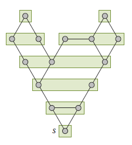
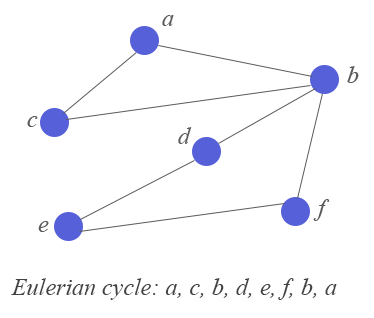
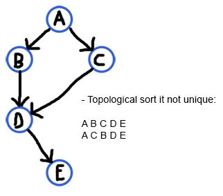
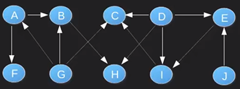
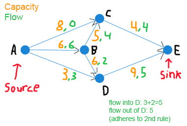

# Quiz 2 Study Guide

## Confident
### Layering Partition
* You are given an undirected graph `G` and some start vertex `s`. Make a layering partition of `G` starting in `s`.
    * Two vertices `u` and `v` are in the same **cluster** if
        * `d(s, u) = d(s, v) = k`
        * `u` and `v` are in the same connected component `G[V``k``]`
    * 

### Floyd-Warshall Algorithm
* You are given a directed weighted graph `G` with potentially negative edge weights and a distance matrix `M``k`. `M``k` contains the distances `d``(k)``ij` computed by the Floyd-Warshall algorithm after `k` iterations. Compute `M``k+1`, i.e., make one iteration of the algorithm and update the matrix as done by the algorithm.
    * 

### Partition Refinement to Find Twins
* You are given an undirected graph `G`. Use a partition refinement to determine all twins `G`.
    * **Twins**: Vertices `u`, `v` such that (`N` = Neighborhood):
        * `N(u) = N(v)`     (false twins)
        * `N[u] = N[v]`     (true twins)

### Eulerian Path/Cycle
* You are given an undirected graph `G`. Find an **Eulerian cycle/path** in `G`.
    * A connected graph has an **Eulerian cycle** if and only if the degree of all vertices is **even**.
        * Similar to Eulerian path but the **start vertex must be the same as the end vertex**
        * 
    * A graph has an **Eulerian path** if and only if it is connected and has at most two degrees with an odd degree
        * Finite graph which visits every edge exactly once
    

## Kinda Comfortable
### Topological Order of DAG
* You are given a directed acyclic graph `G`. Find a **topological order** of the vertices in `G`.
    * **Topological ordering:** A linear ordering of vertices such that for every directed edge `(u,v)`, vertex `u` comes before `v` in the ordering
    * 
    * 
        * Edges:
            * A->B, A->F, B->H, D->C, D->E, D->I, E->I, G->A, G->B, G->C, I->C, J->E
        * Ordering:
            * J G D E I C A F B H

### Maximum s,t Flow
* You are given a directed weighted graph `G` and two vertices `s` and `t`. The edge weights represent the capacities of the corresponding edges. Find a maximum `s`,`t`-flow.
    * A **flow** in a transportation network is a function `f` that assigns to each edge a number so that `0<=(flow along a given edge)<=(capacity along the same edge)`
    * For each vertex `V` other than `source` and `sink`, the total flow into `V` equals the total flow out of `V`
    * 

### Johnson's Algorithm
* You are given a directed weighted graph `G` with potentially negative edge weights. Update the edge weights as done in Johnson’s algorithm such that each edge weight is non-negative.
    * 
